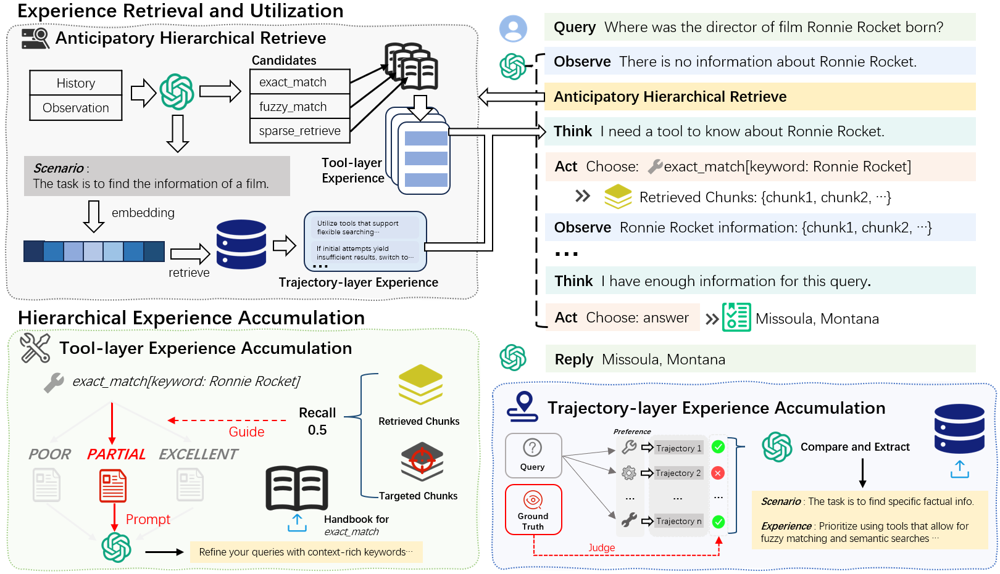

# TCA
This is the repository of the paper: "TCA: Tool Context Adaptation for Agentic Retrieval-Augmented Generation"




## Quick Start
### Create Environment
```bash
git clone https://github.com/zirconiumnmlee/TCA.git
cd TCA
conda create --name tca python=3.10
pip install -r requirements.txt
```
### Configuration
Open `config/base.yaml` to configure your LLM and Embedding Model.
### Build Index
- Dense Retrieval
```bash
cd src/build_index/emb
python index.py --dataset ["hotpotqa", "hotpotqa_test", "2wiki", "2wiki_test", "musique", "musique_test"]
```
> The ChromaDB can be found in "./Output" folder
- Sparse Retrieval
```bash
# ElasticSearch
bash setupElasticSearch.sh
bash startElasticSearch.sh
```
```bash
cd src/build_index/es
python index_<dataset>.py --reindex
# Example
# python index_hotpotqa.py --reindex
```

### Experiment
```bash
cd experiment
```
- Accumulation Stage
```bash
python main.py --dataset hotpotqa --mode ACCUMULATE
# or parallel, if your LLM api support concurrency
python main_parallel.py --dataset hotpotqa --mode ACCUMULATE --concurrency 100
```
- Test Stage
```bash
python main.py --dataset hotpotqa_text --mode TEST
```